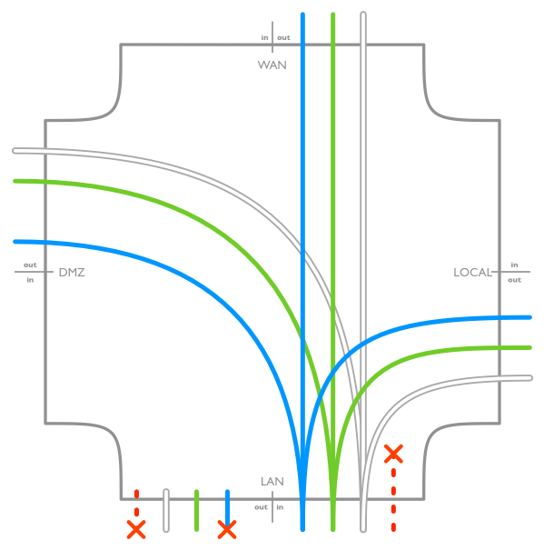
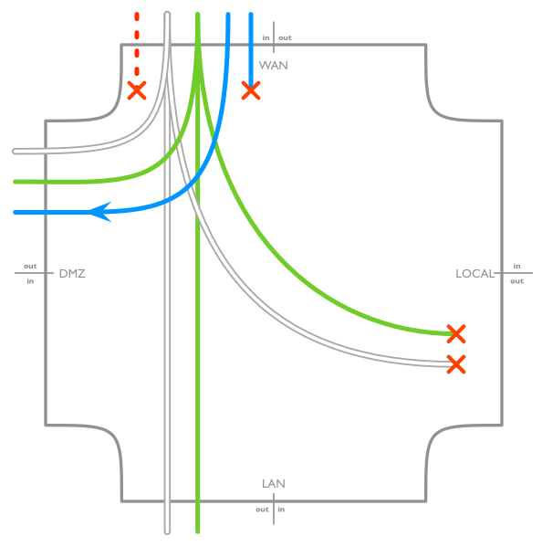
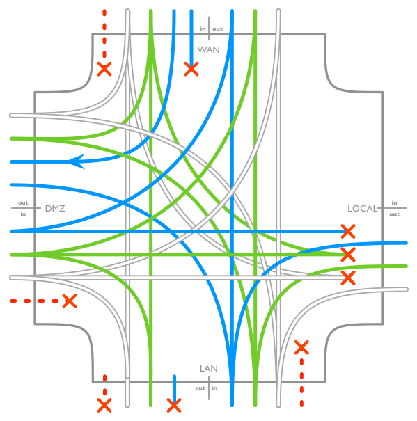

`THIS IS A DRAFT.  DO NOT USE for constructing a production firewall configuration.`

EdgeMax firewall basic rules
============================

There are a few templates on the Internet for configuring firewall rules on Ubiquiti _EdgeRouter_ but no from-scratch guide which may be preferred for better understanding. Also, for visual people at least some imagery may be helpful.

As usual, there are many way to skin a cat. Although there are good practices for configuring firewall rules, there is not a best one. Below is _a way_, to approach the task, without any claims of it's quality or fitness.

While presenting configuration examples in this write-up, the configuration code is simplified to capture the concepts. In firewall riles `disabled` filters are not shown, unless relevant for understanding. Other lines not relevant in a paragraph context are omitted as well. Finally, empty bracket sequences are also dropped.

Interfaces
----------

This write-up walks through a SOHO firewall rules configuration reasoning. It assumes a SOHO setup on _EdgeRouter POE_ with three networks: _LAN_, _WAN_, and _DMZ_. The _LAN_ network is on the single Ethernet connection on `eth0` port of the router. The _WAN_ network is essentially an Ethernet link up to an ISP port via `eth1` port. There are not more than three devices on _DMZ_ in this example, so we will use the build-in switch for that purpose. The `eth2`, `eth3`, and `eth4` ports are assigned to `switch0` interface and all firewall rules then consider only `switch0` as _DMZ_ network interface.

Here is the relevant extract from the configuration:

```
interfaces {
    ethernet eth0 {
        description LAN
    }
    ethernet eth1 {
        description WAN
    }
    ethernet eth2
    ethernet eth3
    ethernet eth4
    switch switch0 {
        description DMZ
        switch-port {
            interface eth2
            interface eth3
            interface eth4
        }
    }
}
```

Canvas
------

First the configuration will be presented in visual form on a canvas, like this:


The main area is a four-sided field, where three sides dedicated to _LAN_, _DMZ_, and _WAN_ interfaces, as marked. The fourth, right, side does not correspond to an interface, but rather to the `local` traffic destination, designated for the router management.

Each canvas side is divided in two parts, which correspond to `in` and `out` traffic directions. Traffic always flows from an `in` to an `out` on the canvas, including the imaginary `local` "`out`". If a line does not extend deep into canvas on an `in` side, it depicts traffic flowing "to any destination". Likewise if a line does not extend deep into canvas on an `out` side, it depicts traffic flowing "from any source".

The type and handling of traffic is shown with colors and shapes of lines and badges in the legend below the canvas above.

Local network
-------------

The _LAN_ network is the most permissive for traffic flowing out of it, yet it also needs to have some safety guards for traffic coming from other directions. Valid incoming traffic  (the `in` direction) is allowed to flow to any other destination, while only valid established connections' traffic is allowed to leave from the router into the _LAN_ network (the `out` direction).



The configuration excerpt demonstrates the _LAN_-related rule sets:

```
firewall {
    name LAN_IN {
        default-action drop
        description "incoming on LAN"
        rule 1 {
            action accept
            description "LAN all valid"
            state {
                established enable
                new enable
                related enable
            }
        }
        rule 2 {
            action drop
            description "LAN invalid"
            state {
                invalid enable
            }
        }
    }
    name LAN_OUT {
        default-action drop
        description "LAN outcoming"
        rule 1 {
            action accept
            description "LAN valid existing"
            state {
                established enable
                related enable
            }
        }
        rule 2 {
            action drop
            description "LAN new & invalid"
            state {
                invalid enable
                new enable
            }
        }
    }
...
```

You may notice the similar rule pattern in configuration examples below: first come rules which are percieved to match most common packets - mostly those are permissive rules. Then come other, less frequently matched  rules. Finally, the rule set's `default-action` clause set to `drop` which discards all unrecognized traffic as a safety precaution. Note that it may not always be possible to order rules by a perceived frequency of matching, as rules may need another logical order for the rule set to make sense.

In addition to configuring the rule sets we also need to bind them to interface configuration, like this:

```
    ethernet eth0 {
        description LAN
        firewall {
            in {
                name LAN_IN
            }
            out {
                name LAN_OUT
            }
        }
    }
```

Perimeter network
-----------------

The _DMZ_ side implements a [perimeter network](http://en.wikipedia.org/wiki/DMZ_%28computing%29). The intent is to allow limited controlled access to hosts in DMZ from public Internet (_WAN_ side), while restricting their access to _LOCAL_ and _LAN_ destinations. Here is the graphical representation of intended flows:


As pictured above, hosts from _DMZ_ should not reach the router itself (the `local` direction) with any traffic. They should be able to respond to all queries from _LAN_, so _DMZ_ `in` allows valid established traffic towards _LAN_. Host in DMZ should also have unrestricted access to public Internet, so there is an explicit rule accepting new connections from _DMZ_ to _WAN_. Here is the configuration excerpt:

```
    name DMZ_IN {
        default-action drop
        description "incoming on DMZ"
        rule 1 {
            action accept
            description "DMZ valid established"
            state {
                established enable
                related enable
            }
        }
        rule 2 {
            action accept
            description "DMZ new to WAN"
            destination {
                group {
                    address-group ADDRv4_eth1
                }
            }
            state {
                new enable
            }
        }
        rule 3 {
            action drop
            description "DMZ invalid"
            state {
                invalid enable
            }
        }
    }
    name DMZ_LOCAL {
        default-action drop
        description "DMZ to router"
    }
```

Note, that the `DMZ_LOCAL` rule set is empty - we want to dismiss all traffic on that path, so default `drop` action does the job. There are no rules to match, so all traffic fill fall through to the default action.

As before, it is necessary to bind the rule sets to relevant interface - `switch0`:

```
    switch switch0 {
        description DMZ
        firewall {
            in {
                name DMZ_IN
            }
            local {
                name DMZ_LOCAL
            }
        }
        switch-port {
            interface eth2
            interface eth3
            interface eth4
        }
    }
```

Internet traffic
----------------

There are two types of traffic from _WAN_ permitted to pass through the router:

0. Any valid communication over already established connections. Presumably most of the connection will be established on requests from _LAN_ and _DMZ_.

0. New connection requests to explicitly permitted _host:port_ combinations in DMZ.



When considering actual configuration this example does not provide an example of how to allow a new connection path to DMZ. Such configuration rule should go after the first rule in the `WAN_IN` rule set. Allowing connections from _WAN_ to _DMZ_ sides is a more complex topic and solutions vary depending on the type of application which traffic is being allowed.

The example also omits throttling and other traffic limits to help with DDOS and similar traffic.

```
    name WAN_IN {
        default-action drop
        description "incoming on WAN"
        rule 1 {
            action accept
            description "WAN valid established"
            state {
                established enable
                related enable
            }
        }

        /* Rules allowing WAN -> DMZ connections go here. */

        rule 2 {
            action drop
            description "WAN new & invalid"
            state {
                invalid enable
                new enable
            }
        }
    }
    name WAN_LOCAL {
        default-action drop
        description "WAN to router"
    }
```

Here are the interface bindings:

```
    ethernet eth1 {
        description WAN
        firewall {
            in {
                name WAN_IN
            }
            local {
                name WAN_LOCAL
            }
        }
    }
```

All together
============

Finally, here is the combined overall picture - and configuration. Hopefully it convinces the reader that is was worth to go over the configuration step-by-step:



```
firewall {
    name DMZ_IN {
        default-action drop
        description "incoming on DMZ"
        rule 1 {
            action accept
            description "DMZ valid established"
            state {
                established enable
                related enable
            }
        }
        rule 2 {
            action accept
            description "DMZ new to WAN"
            destination {
                group {
                    address-group ADDRv4_eth1
                }
            }
            state {
                new enable
            }
        }
        rule 3 {
            action drop
            description "DMZ invalid"
            state {
                invalid enable
            }
        }
    }
    name DMZ_LOCAL {
        default-action drop
        description "DMZ to router"
    }
    name LAN_IN {
        default-action drop
        description "incoming on LAN"
        rule 1 {
            action accept
            description "LAN all valid"
            state {
                established enable
                new enable
                related enable
            }
        }
        rule 2 {
            action drop
            description "LAN invalid"
            state {
                invalid enable
            }
        }
    }
    name LAN_OUT {
        default-action drop
        description "LAN outcoming"
        rule 1 {
            action accept
            description "LAN valid existing"
            state {
                established enable
                related enable
            }
        }
        rule 2 {
            action drop
            description "LAN new & invalid"
            state {
                invalid enable
                new enable
            }
        }
    }
    name WAN_IN {
        default-action drop
        description "incoming on WAN"
        rule 1 {
            action accept
            description "WAN valid established"
            state {
                established enable
                related enable
            }
        }

        /* Rules allowing WAN -> DMZ connections go here. */

        rule 2 {
            action drop
            description "WAN new & invalid"
            state {
                invalid enable
                new enable
            }
        }
    }
    name WAN_LOCAL {
        default-action drop
        description "WAN to router"
    }
}
interfaces {
    ethernet eth0 {
        description LAN
        firewall {
            in {
                name LAN_IN
            }
            out {
                name LAN_OUT
            }
        }
    }
    ethernet eth1 {
        description WAN
        firewall {
            in {
                name WAN_IN
            }
            local {
                name WAN_LOCAL
            }
        }
    }
    ethernet eth2
    ethernet eth3
    ethernet eth4
    switch switch0 {
        description DMZ
        firewall {
            in {
                name DMZ_IN
            }
            local {
                name DMZ_LOCAL
            }
        }
        switch-port {
            interface eth2
            interface eth3
            interface eth4
        }
    }
}
```
-------
